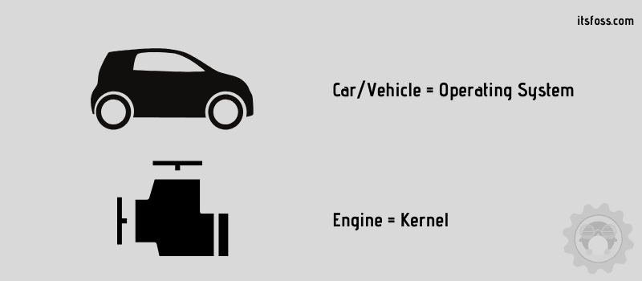

# Why Do We Need Linux Command?
Docker foundation is build on basic Linux concepts. To troubleshoot issues and speed up our development process we need to know some of the basic linux command. In fact, every tutorial in online is based on linux command.

# What is Linux?
Linux is a Unix-like, open source and community-developed operating system (OS) for computers, servers, mainframes, mobile devices and embedded devices. It is supported on almost every major computer platform, including x86, ARM and SPARC, making it one of the most widely supported operating systems.

# What is Linux Distribution?
A Linux distribution is an operating system composed of the Linux kernel, GNU tools, additional software and a package manager. It may also include display server and desktop environment to be used as regular desktop operating system.

The term is Linux distribution (or distro in short form) because an entity like Debian or Ubuntu ‘distributes’ the Linux kernel along with all the necessary software and utilities (like network manager, package manager, desktop environments etc) so that it can be used as an operating system.

Your distributions also takes the responsibility of providing updates to maintain the kernel and other utilities.

So, Linux is the kernel whereas the Linux distribution is the operating system. This is the reason why they are also sometime referred as Linux-based operating systems.

# Linux is just a kernel not an operating system
You might have come across that phrase and that’s entirely correct. The kernel is at the core of an operating system and it is close to the actual hardware. You interact with it using the applications and shell.


To understand that easily, think of operating systems as vehicles and kernal as engines. You cannot drive an engine directly. Similarly, you cannot use kernel directly.



A Linux distribution can be seen as a vehicle manufacturer like Toyota or Ford that provides you ready to use cars just like Ubuntu or Fedora distributions provide you a ready to use operating systems based on Linux.

<details>
<summary>
Some of the linux distros are
</summary>

- Ubuntu
- Debian
- Alpine
- Fedora
- CentOS
</details>

We will use ubuntu in this section.

# Running Linux
1. Goto hub.docker.com
2. Search for Ubuntu.
3. Copy the pull command. (It might show <code>**docker pull ubuntu**</code> )

We will not use the **pull** command. Instead of using **pull** command we will use **run** command. By using **run** command, it will search for the ubuntu image and if it doesn't find it locally, then it will pull the image from docker-hub and start the container.
```
docker run ubuntu
```
After running this command, what will happen?

It ain't doing anything. We know that, after running the **run** command it will start a container. But where is it? Did the container even started?

Of course, it did run. Docker did started a container. Because we didn't interact with that container it stopped immediately.

We can confirm that the container started by executing
```sh
# List of running container
docker ps # shows nothing
# List of all container
docker ps -a # shows all containers including stopped one
```

To start a container and interact with it, we have to execute
```sh
docker run -it ubuntu
```
After running this command, we will see a shell prompt in terminal.
<details>
<summary>What is shell?</summary>

```
A shell is a program that takes our command and pass it to the operating system for execution.
```
</details>

It might show something like this
```sh
root@2fsdsnf3djk:/# 
```
The first part **root** represents the currently logged in user. Currently, we are logged in as root user which have highest privilages. After the '**@**' we have the name of the machine which is automatically generated by Docker. After the '**:**' sign we have '**/**' sign, which represents where we are in file system. '**/**' represents root directory, which is the highest directory in file system.

# Managing Packages in Ubuntu
**apt** (Advance Package Tool) is the package manager for ubuntu.
<details>
<summary>Some of the apt commands are</summary>

```sh
  list - list packages based on package names
  search - search in package descriptions
  show - show package details
  install - install packages
  reinstall - reinstall packages
  remove - remove packages
  autoremove - Remove automatically all unused packages
  update - update list of available packages
  upgrade - upgrade the system by installing/upgrading packages
  full-upgrade - upgrade the system by removing/installing/upgrading packages
  edit-sources - edit the source information file
  satisfy - satisfy dependency strings
```
</details>

Let'us install nano in ubuntu. nano is a basic text-editor for linux. If execute ""nano"", we will get an error
```sh
nano
# bash: nano: command not found
```
which means, we doesn't have nano installed in our ubuntu image. If we execute 
```sh
apt install nano
# E: Unable to locate package nano
```
Why is this happening? We have a package list in ubuntu. We can install the package if the list contains it. We can see the list by executing
```sh
apt list
```
To install a package we have to update the package list. After updating it we can install nano. 
```sh
apt update
# Then
apt install nano
```
Make sure this package is installed by executing **nano** command. If everything goes right, it will show a text-editor in terminal.

We can remove nano from ubuntu by executing
```
apt remove nano
```