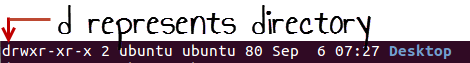
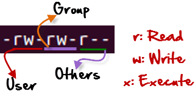
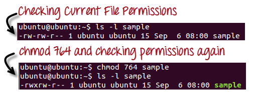
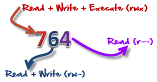
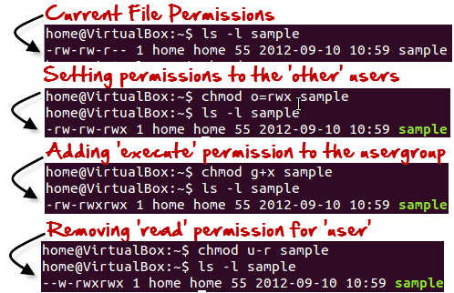

# Linux Command (Part - 2)

## Environment Variables
---
| Command | Description |
| ------- | ----------- |
| ***env***| Print all the environment variables |
| ***echo $variable_name***| To see the value of an individual variable |
| ***export VARIABLE_NAME=value***| It creates a new environmental variable for the current session |
| ***unset VARIABLE_NAME***| It destorys a variable |

If we set environment variable using **export** it won't persist after closing the session. To persist environment variable even after closing, we have to execute the following commands
```sh
cd ~
# then
echo DB_USER=ahnaf >> .bashrc
```

## Managing Process
---
| Command | Description |
| ------- | ----------- |
| ***ps***| Shows the process for current shell |
| ***kill PID***| Kill the process of id PID  |

## Managing Users
---
| Command | Description |
| ------- | ----------- |
| ***useradd [USERNAME]***| Add a new user |
| ***adduser [USERNAME]***| Add a new user (RECOMMENDED) |
| ***userdel [USERNAME]***| Remove an existing user |
| ***passwd [USERNAME]***| Change the password of the user |
| ***usermod -l test_account test_user***| Change the user login name |
| ***usermod -s /bin/bash test_user***| It will create a bash shell for the user "test_user" |

## Managing Groups
---
| Command | Description |
| ------- | ----------- |
| ***groupadd [GROUPNAME]***| Creates a new group |
| ***usermod -G developers ahnaf***| Add ahnaf to developers group |
| ***groups ahnaf***| Shows all the group that contains ahnaf as a user |

# Linux File Permissions
Every file and directory in your Linux system has following 3 permissions defined for all the 3 owners discussed above.

- **Read**: This permission give you the authority to open and read a file. Read permission on a directory gives you the ability to lists its content.

- **Write**: The write permission gives you the authority to modify the contents of a file. The write permission on a directory gives you the authority to add, remove and rename files stored in the directory. Consider a scenario where you have to write permission on file but do not have write permission on the directory where the file is stored. You will be able to modify the file contents. But you will not be able to rename, move or remove the file from the directory.

- **Execute**: In Windows, an executable program usually has an extension “.exe” and which you can easily run. In Unix/Linux, you cannot run a program unless the execute permission is set. If the execute permission is not set, you might still be able to see/modify the program code(provided read & write permissions are set), but not run it.

Let’s see file permissions in Linux with examples:

If we execute **ls -l** on terminal, it shows


Here, we have highlighted **‘-rw-rw-r–‘** and this weird looking code is the one that tells us about the Libux permissions given to the owner, user group and the world.

Here, the first **‘–‘** implies that we have selected a file.


Else, if it were a directory, **d** would have been shown.



The characters are pretty easy to remember.

1. **r** = read permission
2. **w** = write permission
3. **x** = execute permission
4. **–** = no permission

Let us look at it this way.

The first part of the code is ‘rw-‘. This suggests that the owner ‘Home’ can:


- Read the file
- Write or edit the file
- He cannot execute the file since the execute bit is set to **-**.

By design, many Linux distributions like Fedora, CentOS, Ubuntu, etc. will add users to a group of the same group name as the user name. Thus, a user ‘tom’ is added to a group named ‘tom’.

The second part is **‘rw-‘**. It for the user group ‘Home’ and group-members can:

- Read the file
- Write or edit the file

The third part is for the world which means any user. It says **‘r–‘**. This means the user can only:

- Read the file.



## Changin File/Directory Permissions
---
We can use the ***chmod*** command which stands for ‘change mode’ to set permissions (read, write, execute) on a file/directory for the owner, group and the world.
```sh
chmod permssions filename
```

There are 2 ways to use the command - 
1. **Absolute Mode.**
2. **Symbolic Mode.**

### Absolute Mode
In this mode, **file permissions are not represented as characters but a three-digit octal number**.

The table below gives numbers for all for permissions types.

| Number | Permission Type | Symbol |
| ------- | ----------- | -------- |
| 0 | No Permission | --- |
| 1 | Execute | --x |
| 2 | Write | -w- |
| 3 | Execute + Write | -wx |
| 4 | Read | r-- |
| 5 | Read + Execute | r-x |
| 6 | Read + Write | rw- |
| 7 | Read + Write + Execute | rwx |

Let’s see the chmod permissions command in action.



In the above-given terminal window, we have changed the permissions of the file ‘sample to ‘764’.



**764** absolute code says the following:

- Owner can read, write and execute
- Usergroup can read and write
- World can only read

**This is shown as ‘-rwxrw-r–'**

This is how you can change user permissions in Linux on file by assigning an absolute number.

### Symbolic Mode

In the Absolute mode, you change permissions for all 3 owners. In the symbolic mode, you can modify permissions of a specific owner. It makes use of mathematical symbols to modify the Unix file permissions.

|Operator|Description|
|---|---|
|+|Adds a permission to a file or directory|
|-|Removes the permission|
|=|Sets the permission and overrides the permissions set earlier.|

The various owners are represented as –

|Symbol|User Denotations|
|---|---|
|u|User/Owner|
|g|group|
|o|other|
|a|all|

We will not be using permissions in numbers like 755 but characters like rwx. Let’s look into an example

